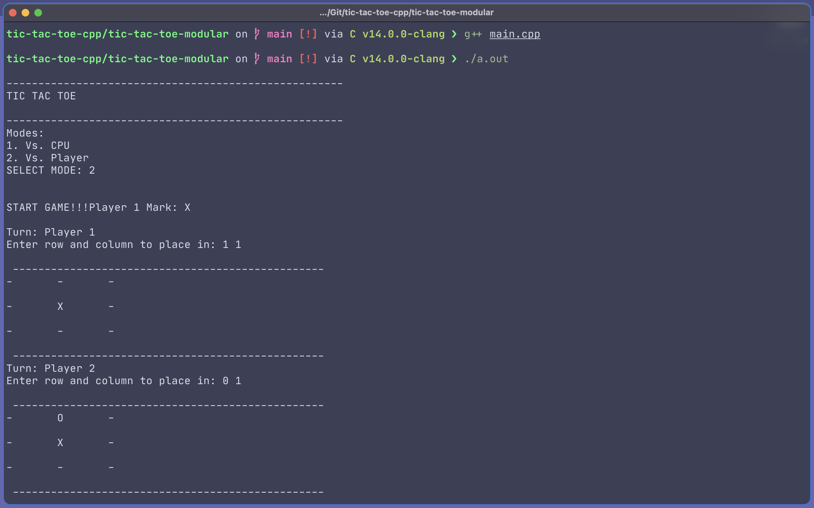

# tic-tac-toe
### A tic-tac-toe game (engine?) 
#### made with OOPS in mind. 
 

 
 

 

### Features: 

 

--- 

### Future Possibilities: 

- Score System
- Better AI
    - Create self forks
- Front End
- (exagerated) engine for similar kind of games 
- Customisability: 
    - Sounds
    - Custom Characters 
    - Visuals
- More+ 

---
### Contributing: 
- Add:
    - Features, 
    - Gameplay Mechanics, 
    - Front end, 
    - +anything that makes it better.

### Support:
- give this project a Star⭐️. 
- Follow contributers.
- Share :)

---

PS. I miss  
